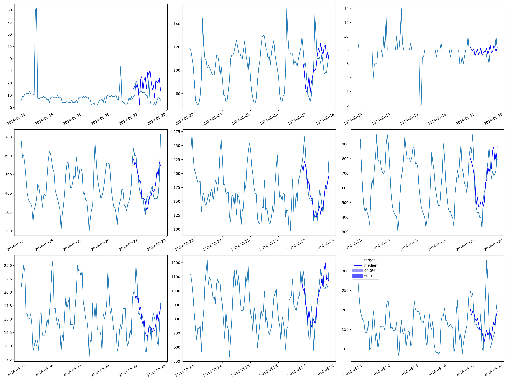

## ffnet-electricity

|       |   Coverage[0.5] |   MAE_Coverage |     MAPE |    MASE |         MSE |    MSIS |      ND |   NRMSE |   OWA |   QuantileLoss[0.5] |    RMSE |   abs_error |   abs_target_mean |   abs_target_sum |   mean_absolute_QuantileLoss |   mean_wQuantileLoss |    sMAPE |   seasonal_error |   wQuantileLoss[0.5] |
|:------|----------------:|---------------:|---------:|--------:|------------:|--------:|--------:|--------:|------:|--------------------:|--------:|------------:|------------------:|-----------------:|-----------------------------:|---------------------:|---------:|-----------------:|---------------------:|
| FFNet |        0.356587 |       0.143413 | 0.234263 | 1.76826 | 1.06494e+07 | 70.7304 | 0.16789 | 1.36812 |   nan |         2.15961e+07 | 3263.34 | 2.15961e+07 |           2385.27 |      1.28633e+08 |                  2.15961e+07 |              0.16789 | 0.212323 |          189.493 |              0.16789 |