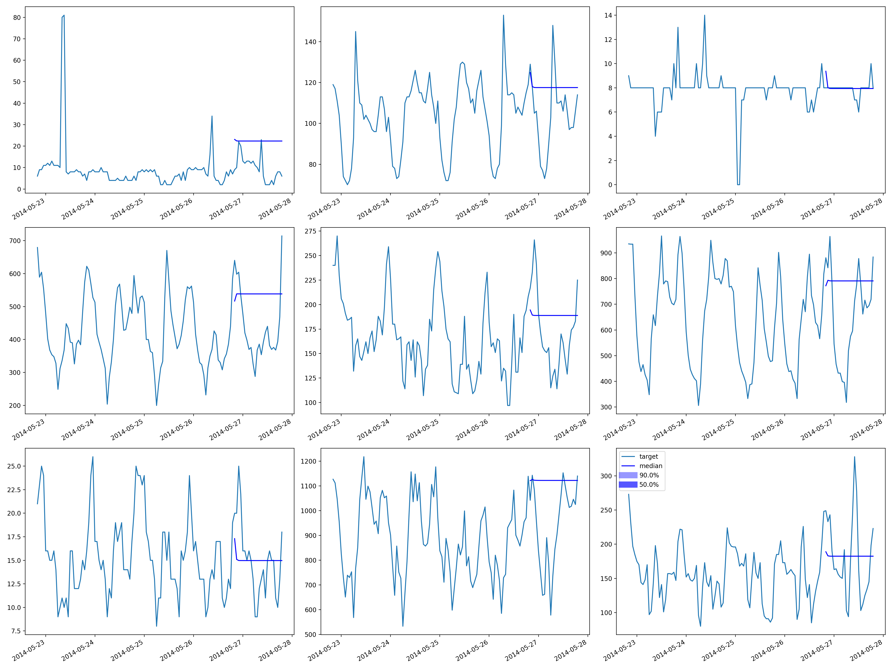

## rnnnet-electricity

|        |   Coverage[0.5] |   MAE_Coverage |     MAPE |    MASE |         MSE |   MSIS |       ND |   NRMSE |   OWA |   QuantileLoss[0.5] |    RMSE |   abs_error |   abs_target_mean |   abs_target_sum |   mean_absolute_QuantileLoss |   mean_wQuantileLoss |    sMAPE |   seasonal_error |   wQuantileLoss[0.5] |
|:-------|----------------:|---------------:|---------:|--------:|------------:|-------:|---------:|--------:|------:|--------------------:|--------:|------------:|------------------:|-----------------:|-----------------------------:|---------------------:|---------:|-----------------:|---------------------:|
| RNNNet |        0.457239 |      0.0427607 | 0.351857 | 2.47183 | 5.36311e+07 | 98.873 | 0.294176 | 3.07023 |   nan |         3.78407e+07 | 7323.32 | 3.78407e+07 |           2385.27 |      1.28633e+08 |                  3.78407e+07 |             0.294176 | 0.274634 |          189.493 |             0.294176 |