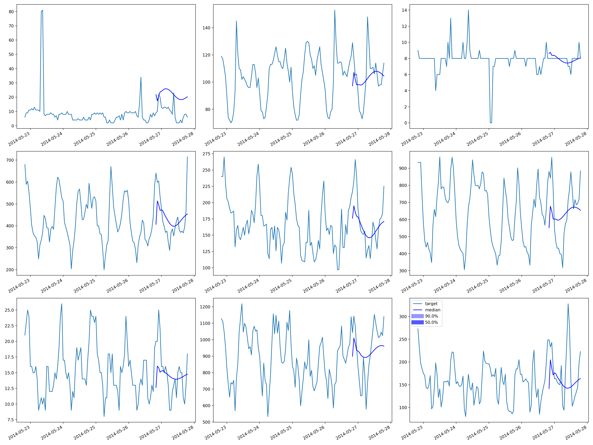

## rnnnet-electricity

|        |   Coverage[0.5] |   MAE_Coverage |    MAPE |    MASE |         MSE |    MSIS |     ND |   NRMSE |   OWA |   QuantileLoss[0.5] |    RMSE |   abs_error |   abs_target_mean |   abs_target_sum |   mean_absolute_QuantileLoss |   mean_wQuantileLoss |   sMAPE |   seasonal_error |   wQuantileLoss[0.5] |
|:-------|----------------:|---------------:|--------:|--------:|------------:|--------:|-------:|--------:|------:|--------------------:|--------:|------------:|------------------:|-----------------:|-----------------------------:|---------------------:|--------:|-----------------:|---------------------:|
| RNNNet |        0.530467 |      0.0304665 | 1.52264 | 15.1616 | 1.04502e+09 | 606.462 | 2.3101 | 13.5526 |   nan |         2.97155e+08 | 32326.7 | 2.97155e+08 |           2385.27 |      1.28633e+08 |                  2.97155e+08 |               2.3101 | 0.82586 |          189.493 |               2.3101 |